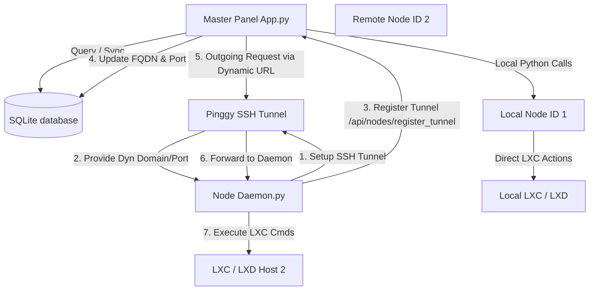

# 🌐 MintyHost LXC: Node System Analysis (Updated FQDN-less Architecture)

This document provides a comprehensive structural and functional analysis of the **Node (Hypervisor) System** in the LXC Control Panel codebase. It details how the master control panel coordinates with multiple distributed Linux container nodes using a secure, FQDN-less daemon-client architecture.

---

## 🏛️ Architectural Overview

The project uses a **Hub-and-Spoke** architecture to support scaling virtual server hosting across multiple physical servers:



- **Master Panel (`app.py`)**: Hosts the web interface, authentication database, API Blueprint (`api_v1.py`), and registers dynamic reverse tunnels from remote nodes.
- **Node Daemon (`daemon.py`)**: Runs on each physical hypervisor node. When a `panel_url` is configured, it launches a background reverse TCP SSH tunnel, reads the dynamically assigned host/port from the tunnel client, and registers it back to the panel.
- **Pinggy Gateway**: Bridges the connection from the public internet back to the local daemon socket, bypassing firewalls, NAT, and removing the requirement for static public IPs, dynamic DNS, or FQDN configuration.

---

## 🗄️ Database Representation

Nodes and VPS instances are modeled inside the SQLite schema ([database.py](file:///C:/Users/User/Desktop/lxc-web/database.py)) as follows:

### 1. The `nodes` Table
Stores details and API keys of active physical servers:
```sql
CREATE TABLE IF NOT EXISTS nodes (
    id INTEGER PRIMARY KEY AUTOINCREMENT,
    name TEXT UNIQUE NOT NULL,
    fqdn TEXT NOT NULL,          -- Updated dynamically by remote nodes (e.g. 'rporty-XXX.free.pinggy.link')
    port INTEGER DEFAULT 5001,   -- Updated dynamically by remote nodes (e.g. 40381)
    location TEXT,               -- Geo-location metadata
    api_key TEXT UNIQUE NOT NULL, -- Secure API authorization key
    status TEXT DEFAULT 'offline',
    created_at TIMESTAMP DEFAULT CURRENT_TIMESTAMP
);
```

### 2. The `vps` Table Linking
Each VPS container belongs to a parent hypervisor node:
```sql
CREATE TABLE IF NOT EXISTS vps (
    id INTEGER PRIMARY KEY AUTOINCREMENT,
    user_id INTEGER NOT NULL,
    container_name TEXT UNIQUE NOT NULL,
    -- ... resources (cpu, ram, disk) ...
    node_id INTEGER DEFAULT 1,    -- Links to nodes(id)
    -- ...
    FOREIGN KEY (node_id) REFERENCES nodes(id) ON DELETE SET DEFAULT
);
```
> [!NOTE]
> The database enforces node isolation. Administrators are prevented from deleting a node if active VPS instances are deployed on it.

---

## 🔌 API Communication Flow

When an operation (Start, Reinstall, Stats, Deploy) is requested:

1. **Check Target Node**: The Panel looks up `vps.node_id`.
2. **Execute Locally** (if `node_id == 1`):
   ```python
   # Directly calls native library in-process
   LXCManager.execute_action(container_name, action)
   ```
3. **Delegate Remotely** (if `node_id > 1`):
   - Retrieves FQDN, Port, and API Key for the remote node.
   - Packages parameters into a secure JSON request via `make_node_request()`.
   - Sends the call to the node's daemon using the `Authorization: Bearer <api_key>` header.
   - Since FQDN and Port are updated in real-time by the node, requests route seamlessly through the active tunnel.

### Remote Node Daemon Endpoints (`daemon.py`)

The daemon exposes endpoints that mirror the capabilities of `LXCManager`:

| Endpoint | Method | Payload Params | Description |
| :--- | :--- | :--- | :--- |
| `/api/node/status` | `GET` | *None* | Verifies if the daemon is alive and responds. |
| `/api/vps/deploy` | `POST` | `name`, `os`, `cpu`, `ram`, `disk`, `password` | Provisions a new LXC container and sets limits. |
| `/api/vps/post-deploy`| `POST` | `name`, `vps_id`, `password`, `site_name` | Triggers background network setups and package updates. |
| `/api/vps/action` | `POST` | `name`, `action` (`start`/`stop`/`restart`) | Executes power actions on containers. |
| `/api/vps/rename` | `POST` | `old_name`, `new_name` | Renames container metadata. |
| `/api/vps/password` | `POST` | `name`, `password` | Re-sets container root passwords. |
| `/api/vps/stats` | `POST` | `name`, `cpu`, `ram`, `disk`, `status`, `vps_id` | Fetches live CPU/RAM/Disk and Pinggy tunnel metrics. |
| `/api/vps/snapshot` | `POST` | `name`, `snap_name` | Takes container snapshot backup. |
| `/api/vps/snapshot/restore` | `POST` | `name`, `snap_name` | Restores container snapshot. |
| `/api/vps/destroy` | `POST` | `name` | Deletes the container and all files. |
| `/api/vps/backup` | `POST` | `name`, `filename` | Performs an `lxc export` to a tarball. |

---

## ⚡ Automated Remote Node Provisioning

Adding a new node requires zero manual configuration on the target server. The setup uses an automated bootstrap script:

```
[Admin Panel] --(Gen Config/Cmd)--> [Admin UI] --(Copy & Run)--> [Remote Shell (curl | bash)]
                                                                           |
                                                                  Downloads node.sh
                                                                           |
                                                                Installs LXD & PyEnv
                                                                           |
                                                             Configures mintyhost-node.service
```

1. **Registration**: Administrator adds a new node name, location, and port in the Panel UI. The FQDN can be left blank (defaults to `dynamic`). A unique API Token is generated.
2. **1-Click Shell Script Generation**: The Panel generates a custom installer command containing the Panel URL:
   ```bash
   curl -sSL http://<panel_url>/node.sh | NODE_PORT=5001 NODE_API_KEY="<api_key>" NODE_ID=<node_id> NODE_NAME="<node_name>" PANEL_URL="http://<panel_url>" bash
   ```
3. **Execution ([node.sh](file:///C:/Users/User/Desktop/lxc-web/node.sh))**:
   - Updates APT and installs system packages: `python3`, `snapd`, `bridge-utils`, `uidmap`, `openssh-client`, `curl`.
   - If running interactively, the script prompts the user for missing `NODE_ID`, `NODE_API_KEY`, or `PANEL_URL` inputs from `/dev/tty`.
   - Installs and configures **LXD Snap**: `snap install lxd` followed by auto-initializing the bridge (`lxd init --auto`).
   - Clones the daemon source code repository.
   - Spins up a Virtual Environment (`venv`) and installs pip dependencies from `requirements.txt`.
   - Writes `config.yml` mapping environment configuration parameters including `panel_url`.
   - Installs and registers a `mintyhost-node.service` systemd service running `daemon.py` on boot.

---

## 🔄 Dynamic Registration & Status Monitoring

### 1. Dynamic Tunnel Registration (`/api/nodes/register_tunnel`)
When the remote daemon restarts or reconnects, it invokes a thread to establish an SSH reverse tunnel to Pinggy:
- **SSH Command**:
  ```bash
  ssh -T -p 443 -o StrictHostKeyChecking=no -o UserKnownHostsFile=/dev/null -o ServerAliveInterval=30 -R0:127.0.0.1:5001 tcp@free.pinggy.io
  ```
- **Parsing**: The thread parses the output to read the dynamically assigned endpoint.
- **Reporting**: The daemon calls `/api/nodes/register_tunnel` on the panel with its node ID and API key to register its temporary address.
- **Updating**: The panel updates the FQDN, Port, and marks the node status as `online` in the database.

### 2. Tunnel Monitor Synchronization (`pinggy_monitor.py`)
Containers use a temporary Pinggy connection relay to forward SSH traffic out of internal LXC bridges. Because free Pinggy tunnels restart every 1 hour, a persistent monitoring thread handles updates:
- Runs every 10 seconds.
- Loops through all database instances with `status = 'running'`.
- For remote VPS nodes, it queries the node daemon's `/api/vps/stats` endpoint.
- It extracts the live `tunnel_host` and `tunnel_port` read from the container filesystem.
- If the values differ from the database (indicating a tunnel restart), it automatically updates the central database so client connection panels reflect the latest SSH details immediately.
